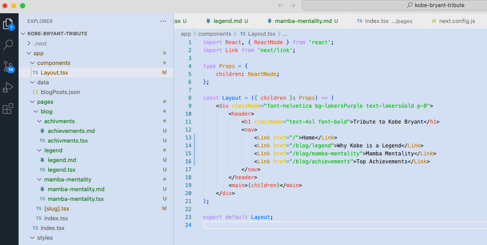

<a href="https://aexol.com">
<picture>
  <source media="(prefers-color-scheme: dark)" srcset="assets/Dark.svg">
  <source media="(prefers-color-scheme: light)" srcset="assets/Light.svg">
  
</picture>
</a>

*Theme for VS Code*

## Table of contents

-   [Example Screenshot](#example-screenshot)
-   [Installation](#installation)
-   [Customize Theme](#customize-theme)
-   [Find us!](#find-us)
-   [License](#license)

### Example screenshot📷

---
### Installation🚀

To install the theme use any of these methods:
- go on our themes [marketplace page](https://marketplace.visualstudio.com/items?itemName=AexolStudio.aexol-studio-color-theme) and click install
- open VS Code, click Extensions on the left toolbar (`View -> Extensions`), search for Aexol Studio Theme, select it and click install
- enter this command into your VS Code terminal `ext install Aexol Studio Theme`

The installation should be done in a few seconds, now you need to set it as your active color theme by using:

- Linux or Windows: Ctrl + Shift + P
- macOS ⌘ + Shift + P

This will open the Quick Open dropdown, now just type in 'theme', choose `Preferences: Color Theme`, and select one of the **Aexol Studio Theme** variants from the list. You should immediately see a change in how your VS Code looks like!

---
### Customize Theme

You can customize the **Aexol Studio Theme** colors by adding theme-specific settings to your configuration. For advanced customization please check the relative section on the [VS Code documentation](https://code.visualstudio.com/docs/getstarted/themes#_customizing-a-color-theme). If you want to you can also just fork the project since its open source.

If you have some ideas on how to improve our theme just create an issue and we'll get on it ASAP!

---
## Find us!

E-mail: [office@aexol.com](mailto:office@aexol.com)\
Site: [https://aexol.com/](https://aexol.com/)  

#### If you like this project, let us know by leaving a star on this repository ❤️ ;)

Best regards,
 
<a href="https://aexol.com">
<picture>
  <source media="(prefers-color-scheme: dark)" srcset="assets/Dark.svg">
  <source media="(prefers-color-scheme: light)" srcset="assets/Light.svg">
  
</picture>
</a>

## License📜

This theme pack extension is released under the MIT License.\
Copyright &copy; 2024 Aexol. All rights reserved.
